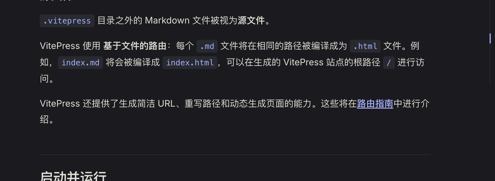

# 什么是Node.js

## 1. Node.js 是什么？

Node.js 是一个基于 ​​Chrome V8 JavaScript 引擎​​ 的 ​​JavaScript 运行时环境​​，它让 JavaScript 不再局限于浏览器环境，而是可以运行在服务器端、命令行甚至物联网设备上。

## 2. Node的核心模块

### (1)文件系统模块

Node.js 内置了用于与文件系统进行交互的模块，主要是 `fs` 模块。通过它可以实现对文件的读写、重命名、删除等操作。以下是常用方法示例：

### 示例读取文件内容（同步和异步）

```js
// 引入fs模块
const fs = require('fs')

// 异步读取文件
fs.readFile('example.txt', 'utf8', (err, data) => {
  if (err) {
    console.error('读取文件出错:', err)
    return
  }
  console.log('异步读取文件内容:', data)
})

// 同步读取文件
try {
  const data = fs.readFileSync('example.txt', 'utf8')
  console.log('同步读取文件内容:', data)
} catch (err) {
  console.error('同步读取文件出错:', err)
}
```

### 示例：写入文件

```js
// 异步写入
fs.writeFile('output.txt', '写入内容', (err) => {
  if (err) {
    console.error('写入文件出错:', err)
    return
  }
  console.log('文件写入成功!')
})

// 同步写入
try {
  fs.writeFileSync('output.txt', '同步写入内容')
  console.log('同步写入成功!')
} catch (err) {
  console.error('同步写入文件出错:', err)
}
```

### 更多常用方法

- `fs.rename` / `fs.renameSync`：重命名文件
- `fs.unlink` / `fs.unlinkSync`：删除文件
- `fs.mkdir` / `fs.mkdirSync`：创建文件夹
- `fs.readdir` / `fs.readdirSync`：读取目录内容

### 文档参考

- [Node.js 官方fs模块文档](https://nodejs.org/api/fs.html)

<!--  -->
